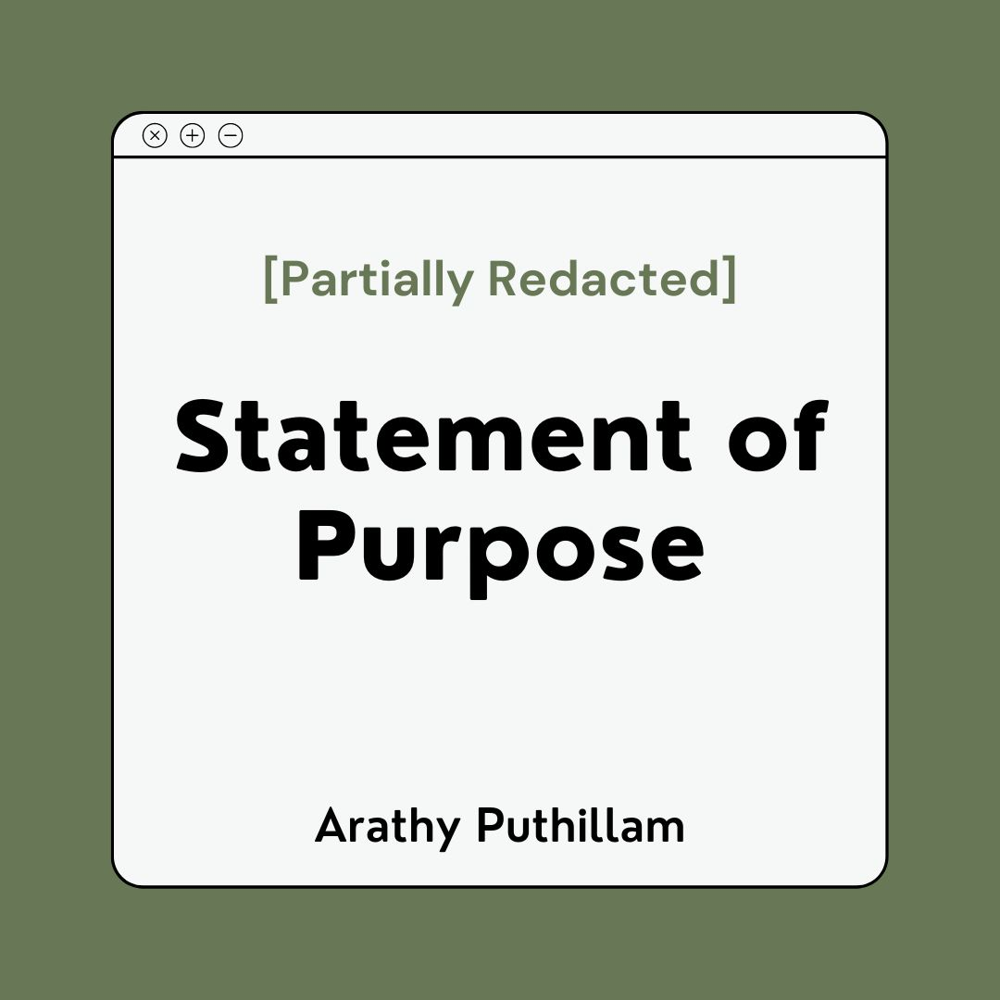
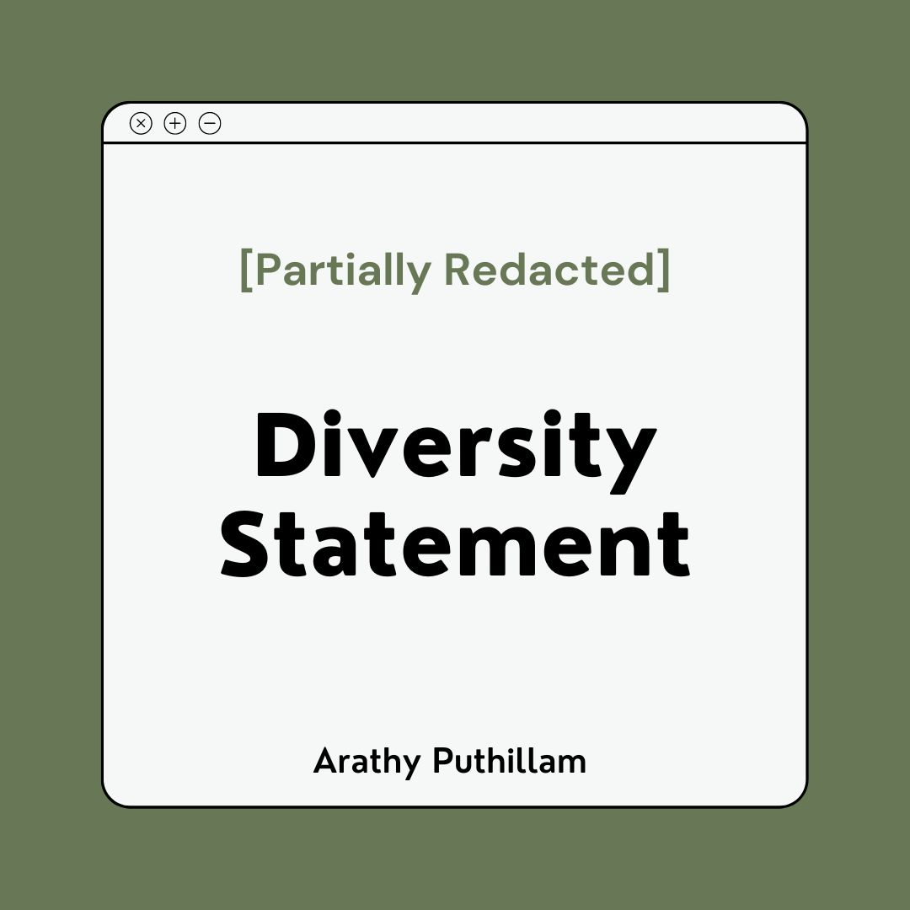

When I applied for graduate school in 2021, I was fortunate enough to receive valuable mentorship from various sources, example statements of previous applicants, and many helpful comments on mine. 

To pay it forward, I have created a guide for future applicants from outside North America with my friend <u>[Haniya](https://hrumaney.netlify.app/)</u>. I am also posting my application materials. 

-------------
### [Applying to Social Psych PhDs as an International student: An informal, subjective guide](https://osf.io/bxygh)

As international applicants to North American PhD programs in social psychology, my friend <u><href>[Haniya](https://hrumaney.netlify.app/)</u> and I realized that there are some things that we couldn't have learnt without mentorship. To help future applicants like us navigate the North American graduate school application process, we created an informal guide. You can access the guide <u><href>[here](https://osf.io/bxygh)</u>.

-------------
### [Statement of Purpose](https://osf.io/g6qas)

Most schools would require you to include a statement of purpose. It might also have other names, such as a statement of intent, an academic history, or a research statement. I have included an example statement of purpose <u><href> [here](https://osf.io/g6qas) </u>, based on a couple of schools where I had gotten in. 

_Note: Parts of the statement are redacted_. 

-------------
### [Personal History Statement](https://osf.io/s45cj)

Some schools ask you to write a personal history or diversity statements. I have included an example statement <u><href> [here](https://osf.io/s45cj) </u> - this is what I had submitted for the only school from my list that required it. To be very honest, I did <i> not </i> get into this school, so you should take this with a pinch of salt. 

_Note: Parts of the statement are redacted_.    